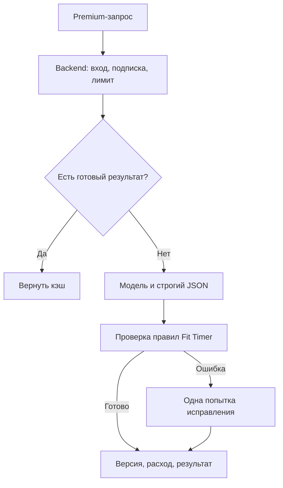

# Fit Timer: план платной AI-генерации

Статус: план, без реализации. Актуальность цен и моделей проверена 18 сентября
2026 года. Перед внедрением названия моделей и тарифы нужно проверить ещё раз.

## Решение в одном абзаце

AI работает только через backend Fit Timer и только после серверной проверки
Premium. Ключ провайдера никогда не попадает в приложение. Простые запросы и
правки выполняет быстрая недорогая модель, полную программу при необходимости
проверяет более сильная. Модель возвращает не свободный текст, а JSON по строгой
схеме Fit Timer. Изображения упражнений не генерируются заново каждому человеку:
они привязываются к каноническому упражнению, проходят проверку и повторно
используются всеми. Это одновременно повышает качество и сильнее всего снижает
расходы.

## Что должен уметь первый релиз

| Сценарий | Результат | Режим |
|---|---|---|
| Новая программа | Полная программа под цель, опыт, инвентарь и ограничения | Синхронно, затем проверка |
| Изменение программы | Только запрошенные изменения с сохранением остального | Синхронно, как patch |
| Новое упражнение | Одно или несколько упражнений в допустимом формате | Синхронно |
| Замена упражнения | Равноценная замена с объяснимой причиной | Синхронно |
| Картинка упражнения | Единая понятная иллюстрация техники | Фоновая задача и общий кэш |
| Обложка программы | Декоративная персональная обложка без инструкций | Фоновая задача |

Генерация видео на первом этапе не нужна: она заметно дороже, дольше и сложнее
для проверки правильности техники.

## Архитектура

Нужен один серверный интерфейс, например `POST /api/ai/jobs`, а тип операции
передаётся в `kind`:

- `program.create`;
- `program.modify`;
- `exercise.create`;
- `exercise.replace`;
- `exercise.image`;
- `program.cover`.

Длинные операции получают `jobId`; клиент опрашивает состояние или получает
обновление после возврата в приложение. Повтор запроса с тем же idempotency key
не должен повторно списывать лимит или запускать модель.

## Как выбирать модели

Не привязывать продукт к Gemini или любому другому поставщику. В backend нужен
маленький адаптер с настройками `AI_TEXT_PROVIDER`, `AI_TEXT_MODEL_FAST`,
`AI_TEXT_MODEL_STRONG` и `AI_IMAGE_MODEL`. Тогда провайдера можно сменить без
обновления APK.

Рекомендуемый стартовый маршрут:

1. Недорогая Flash/Lite/mini-модель выполняет новые упражнения, замены, обычные
   правки и первичную генерацию программы.
2. Сильная модель вызывается только если валидатор нашёл проблему либо запрос
   сложный: травмы, несколько ограничений, нетипичная периодизация.
3. Для изображений сначала сравнить на одном наборе заданий Gemini Flash Lite
   Image и быстрый вариант GPT Image. Выбрать не по названию, а по доле корректных
   поз, стилевой стабильности и цене принятого изображения.

На момент подготовки плана Google указывает для `gemini-3.5-flash-lite` цену
$0.30 за 1 млн входных и $2.50 за 1 млн выходных токенов; для
`gemini-3.1-flash-lite-image` — около $0.0336 за изображение 1K. OpenAI приводит
для GPT Image 2.5 низкое качество примерно от $0.0059 за изображение и отдельно
рекомендует быстрый вариант для повседневной генерации. Эти цифры — ориентир для
теста, а не причина заранее выбрать одного поставщика.

Источники:

- [Gemini API pricing](https://ai.google.dev/gemini-api/docs/pricing)
- [Gemini structured outputs](https://ai.google.dev/gemini-api/docs/structured-output)
- [Gemini image generation](https://ai.google.dev/gemini-api/docs/image-generation)
- [OpenAI structured outputs](https://developers.openai.com/api/docs/guides/structured-outputs)
- [OpenAI image generation](https://developers.openai.com/api/docs/guides/image-generation)

## Формат данных и качество

Текущий обмен большим текстовым шаблоном оставить только для ручного сценария
«скопировать в чат». Встроенный AI должен возвращать JSON Schema с теми же
сущностями, которые уже понимает Fit Timer: программа, варианты, разминка,
упражнения, подходы, повторы/время, отдых и подсказки.

После модели выполняется обычный код, а не второй «судья-бот»:

- ограничивает число упражнений и длительность;
- проверяет обязательные поля и типы;
- не допускает отрицательные значения, невозможные интервалы и дубликаты;
- сверяет инвентарь и ограничения пользователя;
- сохраняет исходную программу при изменении и применяет только patch;
- создаёт новую версию, чтобы любое изменение можно было отменить.

Для медицинских ограничений AI не ставит диагнозов. При боли, травме или
противоречивых данных он предлагает безопасно остановиться и обратиться к
специалисту. В интерфейсе остаётся короткое предупреждение, что программа не
заменяет медицинскую консультацию.

## Изображения без лишних расходов

### Упражнения

Картинка упражнения — учебный материал, поэтому нельзя выдавать случайную
генерацию как гарантированно правильную технику.

1. Нормализовать упражнение до `canonicalExerciseId`, например
   `bodyweight_squat`.
2. Сначала искать уже принятую картинку этого упражнения, ракурса и типа
   инвентаря.
3. При отсутствии создать одну иллюстрацию 1024×1024 в общем стиле Fit Timer.
4. Автоматически проверить формат, отсутствие текста/логотипов и базовые
   дефекты; новую позу отправить в очередь владельцу/тренеру на принятие.
5. После принятия сжать в WebP/AVIF, положить в объектное хранилище и повторно
   использовать для всех пользователей.

То есть Premium-пользователь запускает появление недостающего материала, но мы
не оплачиваем одну и ту же картинку сотни раз.

### Обложки программ

Обложка декоративная и не учит технике, поэтому может генерироваться персонально.
Для неё достаточно низкого или среднего качества, одного варианта и фиксированной
палитры. Одинаковый prompt fingerprint возвращает кэш. Повторная генерация —
отдельное действие с лимитом.

## Premium, лимиты и защита бюджета

Premium проверяется сервером до постановки задачи и ещё раз перед дорогой
генерацией. Клиентское `isPremium()` остаётся только для интерфейса и не является
защитой.

Для запуска разумен месячный пакет:

- 30 тяжёлых текстовых операций (новая программа или крупная переработка);
- 100 лёгких правок/замен;
- 10 запросов изображений, причём попадание в общий кэш лимит не расходует;
- не более одной активной тяжёлой задачи на аккаунт.

Внутри считать реальную себестоимость каждой операции. Лимиты можно увеличить
после месяца фактических данных. Обязательны общий месячный hard cap, дневной
лимит на пользователя, алерт при 50/75/90% бюджета и аварийное отключение только
изображений без остановки текстовых функций.

Главные способы экономии:

- не отправлять модели историю приложения — только профиль, текущую программу и
  запрос;
- для правки возвращать patch, а не переписывать всю программу;
- задавать максимальный размер ответа и отключать лишнее рассуждение;
- хэшировать нормализованные запросы и повторно использовать результат;
- хранить изображения по каноническому упражнению;
- фоновую массовую подготовку каталога запускать Batch-тарифом;
- не использовать web search: для составления программы он не нужен и создаёт
  отдельные расходы и непредсказуемые источники.

## Серверные данные

Минимально нужны четыре сущности:

| Сущность | Что хранит |
|---|---|
| `ai_jobs` | Тип, состояние, владелец, idempotency key, ошибки и время |
| `ai_usage` | Провайдер, модель, токены/изображения, стоимость и Premium-период |
| `ai_assets` | Каноническое упражнение, prompt hash, файл, статус проверки |
| `ai_prompt_versions` | Версия схемы и промта для воспроизводимости |

В логах нельзя хранить API-ключи. Пользовательский запрос и профиль нужно либо
хранить ограниченное время, либо редактировать до безопасного диагностического
набора. Это решение фиксируется в Privacy Policy до запуска.

## Как выбрать поставщика до разработки

Подготовить закрытый тест из 40 запросов:

- 10 полных программ;
- 10 точечных изменений без порчи остальных данных;
- 10 упражнений/замен с разным инвентарём;
- 10 изображений, включая сложные позы и инвентарь.

Одинаковые задания прогнать через двух кандидатов. Оценивать:

| Метрика | Вес |
|---|---:|
| Безопасность и корректность тренировки/позы | 35% |
| Валидный JSON без ремонта | 20% |
| Точное выполнение запроса | 20% |
| Естественный русский язык | 10% |
| Цена принятого результата | 10% |
| Задержка | 5% |

Побеждает модель с лучшей стоимостью принятого результата, а не самого дешёвого
вызова. Тест и ожидаемые ответы сохраняются, чтобы повторять сравнение при смене
моделей.

## Этапы внедрения

1. Зафиксировать JSON Schema и написать детерминированный валидатор.
2. Добавить серверную проверку Premium, учёт и hard cap.
3. Реализовать адаптер одного текстового провайдера и тестовый набор.
4. Перевести новую программу, упражнение, замену и изменение на серверный API.
5. Удалить пользовательский Gemini-ключ из боевого интерфейса после миграции.
6. Добавить очередь изображений, хранилище, кэш и экран проверки материалов.
7. Провести закрытый запуск, измерить стоимость и только затем расширить лимиты.

## Что потребуется от владельца перед реализацией

Без владельца нельзя окончательно решить только следующее:

1. Какой реальный тариф Premium и желаемая максимальная себестоимость AI на одного
   активного платного пользователя в месяц.
2. Кто принимает новые учебные изображения упражнений: владелец или тренер.
3. Разрешено ли временно хранить обезличенные запросы для улучшения качества и на
   какой срок.
4. Аккаунт и платёжный профиль выбранного AI-провайдера; ключ будет добавлен
   только в серверные environment variables.

До выбора модели сначала нужен небольшой платный сравнительный прогон, обычно на
несколько долларов. Текущий пользовательский Gemini-ключ годится для прототипа,
но его нельзя считать production-архитектурой или помещать в APK.

## Правила для следующих ИИ

- Этот файл описывает намерение, а не готовую функцию.
- Не переносить существующий Gemini-ключ на сервер и не включать API без решения
  владельца о бюджете, провайдере и хранении данных.
- Premium всегда проверяется на backend; скрытая кнопка в клиенте не является
  защитой.
- Не принимать свободный текст модели напрямую: только схема, валидация и версия.
- Не публиковать непроверенную AI-картинку упражнения как инструкцию по технике.
- Имена моделей и цены устаревают; перед кодом повторить benchmark и сверить
  официальные тарифы.
